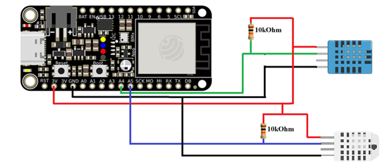

# The weather station measures temperature and humidity

System for monitoring air temperature and humidity inside the greenhouse and outside the greenhouse. The monitored values are sent to the ThingSpeak and Grafana platforms.

## ESP32 & ThingSpeak & Grafana
> To start, review and follow steps in the **[Grafana DIY IoT repo](https://github.com/grafana/diy-iot)**.

## Hardware

To build this system, you will need:
- **1 DHT11** sensor to measure temperature and humidity inside
- **1 DHT22** sensor to measure temperature and humidity outside
- **1 ESP32** development board

## Libraries:

- **DHT sensor library by** Adafruit
- **Adafruit Unified Sensor** by Adafruit
- **NTP Client** by Fabrice Weinberg
- **ThingSpeak** by Mathworks
